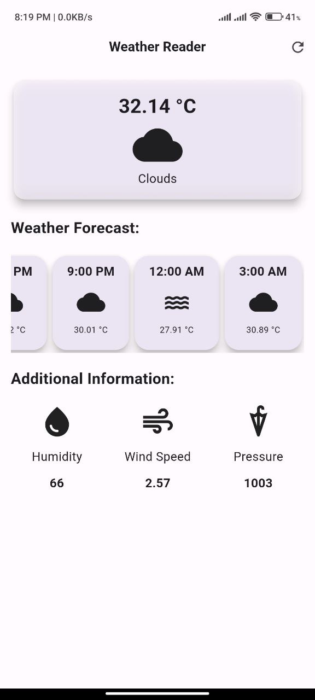

    

    <b style="font-size: 35px;">WeatherReader</b>
     
    An app for reading weather

    
    <!--  -->
    <!--  -->

My single-page weather application exemplifies simplicity and speed. Meticulously designed with an emphasis on aesthetics and user-friendliness, this application boasts an exceptional user interface, providing users with real-time weather data at their fingertips. Its intuitive design ensures that accessing up-to-the-minute weather information is both effortless and efficient. Whether individuals are planning their day or staying informed about dynamic weather conditions, this application offers a streamlined and visually compelling solution for all their weather-related needs.

[Download WeatherReader](weatherreader.apk)
